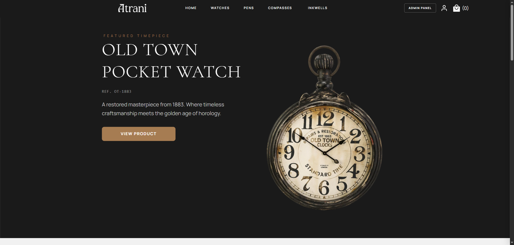
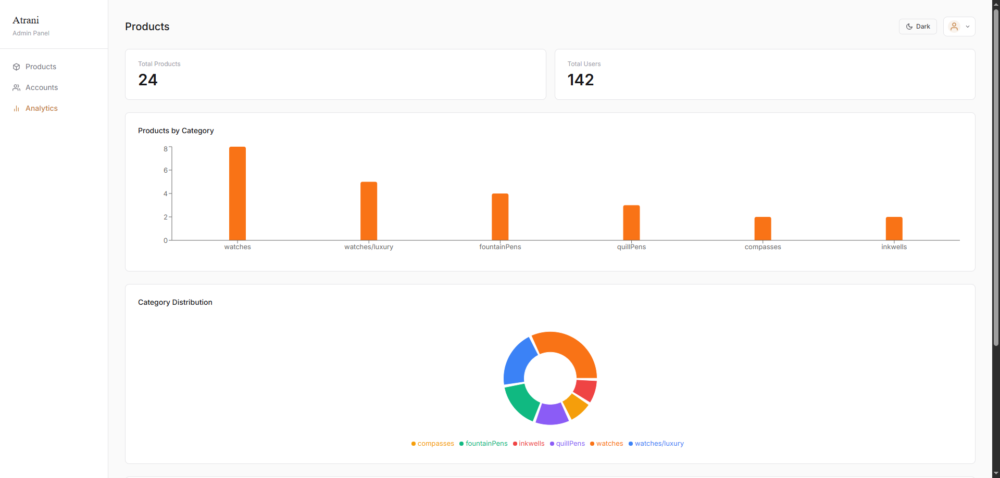
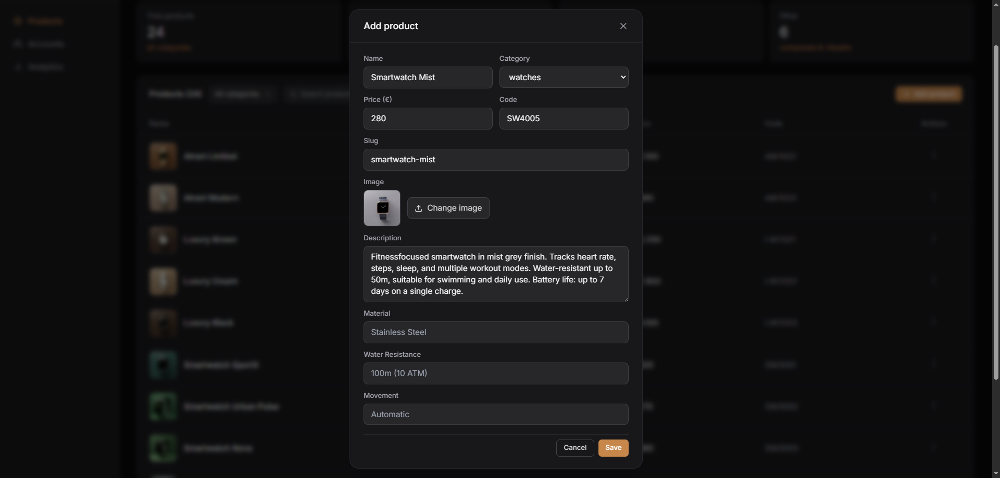
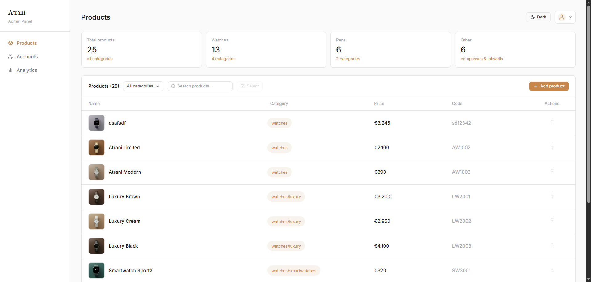
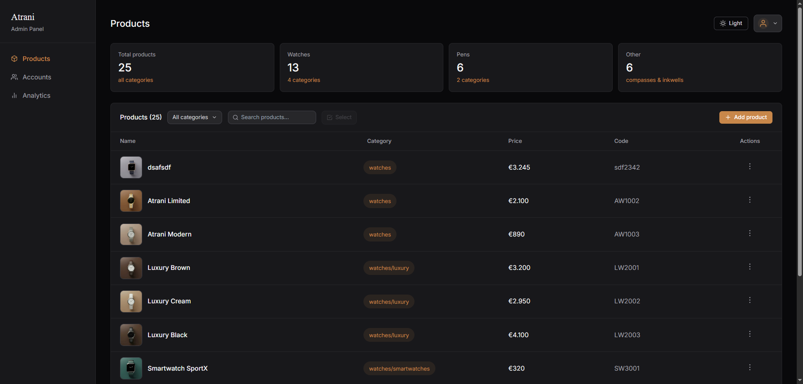
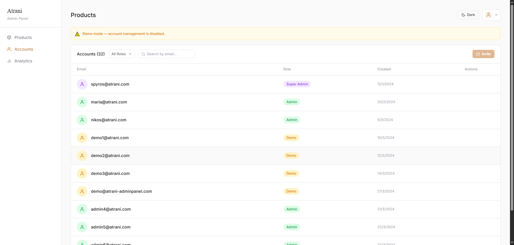

# Atrani Watches — Full Stack E-Commerce Platform

A production-ready full-stack e-commerce platform for a luxury watches and fine writing instruments brand. Built with a React storefront, a Node.js/Express REST API, and a custom admin panel — all connected to a PostgreSQL database hosted on Neon.

---

## What's inside

```
atrani-watches/
├── frontend/       React storefront (Vite + TypeScript + Tailwind)
├── backend/        Node.js + Express REST API
└── admin-panel/    React admin dashboard (Vite + TypeScript + Tailwind)
```

## Screenshots

<div align="center">
  <a href="./assets/atrani.png"></a>
  <a href="./assets/analytics.png"></a>
  <a href="./assets/add-product.png"></a>
  <a href="./assets/product-tables.png"></a>
  <a href="./assets/product-tables-dark.png"></a>
  <a href="./assets/user-tables.png"></a>
</div>

---

## Frontend — Customer Storefront

The public-facing store where customers browse products, create accounts, and manage their profiles.

**Tech:** React 18, TypeScript, Vite, Tailwind CSS, React Router

**Features:**
- Product catalog with category filtering (watches, fountain pens, quill pens, compasses, inkwells)
- Dynamic product detail pages with slug-based routing
- Related products fetched from the database
- User authentication — email/password + Google OAuth
- Email verification on signup (via Brevo transactional email API)
- JWT-based session management stored in localStorage
- Responsive design with dark mode support
- OS-style draggable/resizable UI elements
- Optimized image loading via Cloudinary CDN

---

## Backend — REST API

A Node.js/Express server that powers both the storefront and the admin panel.

**Tech:** Node.js, Express, PostgreSQL (Neon), Prisma-compatible schema, bcrypt, JSON Web Tokens, Passport.js, Cloudinary, Brevo, Multer

**Architecture:** Modular route structure — no monolithic index.js

```
backend/
├── index.js           App setup + server bootstrap
├── middleware/
│   └── auth.js        JWT verification middleware
├── routes/
│   ├── auth.js        Admin login + Google OAuth callbacks
│   ├── users.js       Signup, login, email verify, /me
│   ├── products.js    Product CRUD + image upload
│   └── admins.js      Admin management, invite system, stats
└── utils/
    └── email.js       Brevo email client + email templates
```

**API endpoints:**

| Method | Endpoint | Description |
|--------|----------|-------------|
| POST | `/api/auth/login` | Admin login |
| GET | `/api/auth/google` | Google OAuth initiation |
| GET | `/api/auth/google/callback` | Google OAuth callback |
| POST | `/api/users/signup` | Customer registration |
| GET | `/api/users/verify` | Email verification |
| POST | `/api/users/login` | Customer login |
| GET | `/api/users/me` | Get current user |
| GET | `/api/products` | Get all products (with category filter) |
| GET | `/api/products/:slug` | Get single product |
| POST | `/api/products` | Create product (admin only) |
| PUT | `/api/products/:id` | Update product (admin only) |
| DELETE | `/api/products/:id` | Delete product (admin only) |
| POST | `/api/products/upload` | Upload image to Cloudinary |
| GET | `/api/admins` | List all admins |
| POST | `/api/admins/invite` | Send invite email |
| POST | `/api/admins/accept-invite` | Accept invite + set password |
| PUT | `/api/admins/:id/role` | Change admin role |
| DELETE | `/api/admins/:id` | Delete admin |
| GET | `/api/stats` | Dashboard statistics |

**Security:**
- Passwords hashed with bcrypt (salt rounds: 10)
- JWT tokens for both admin and customer sessions (separate expiry)
- Role-based access control: `superadmin`, `admin`, `demo`
- Protected routes via `authMiddleware` + `requireAdmin` + `requireSuperAdmin`
- Google OAuth via Passport.js

**Integrations:**
- **Neon** — serverless PostgreSQL (EU Central, v17)
- **Cloudinary** — image upload and CDN delivery
- **Brevo** — transactional emails (verification + admin invites)
- **Passport.js** — Google OAuth 2.0 strategy

---

## Admin Panel

A full-featured dashboard for managing the store — built as a completely separate React app.

**Tech:** React 18, TypeScript, Vite, Tailwind CSS, React Router, Recharts

**Architecture:** Components are organized by responsibility

```
admin-panel/src/
├── components/
│   ├── ui/           Reusable primitives (Button, Checkbox, FilterDropdown, SearchInput, Pagination, MultiSelect, Tooltip)
│   ├── layout/       App structure (Sidebar, Topbar, ProtectedRoute)
│   ├── modals/       Modal dialogs (ConfirmModal, Modal, ProductForm)
│   └── features/     Business logic (ProductsTable, Accounts, Analytics, StatsCards, ActionMenu)
├── context/          React Context (AuthContext, ProductsContext, ThemeContext)
├── hooks/            Custom hooks (useProducts)
├── pages/            Route-level pages (Login, AcceptInvite)
└── types/            TypeScript interfaces
```

**Features:**

*Products*
- Full CRUD — add, edit, delete products
- Image upload via Cloudinary
- Search, category filter, pagination
- Multi-select with bulk delete
- Custom Checkbox component with light/dark mode styling
- All mutations protected with Authorization header

*Accounts*
- View all admins with role badges (Super Admin / Admin / Demo)
- Invite new admins via email — JWT-signed invite link (48h expiry)
- Accept invite page — set password and activate account
- Change roles, delete admins (superadmin only)
- Search by email + filter by role + pagination

*Analytics*
- Bar chart — products by category
- Pie chart — category distribution
- Line chart — new users over last 30 days
- Powered by Recharts

*Auth*
- JWT login with role-based access
- Demo mode — read-only with mock data, no destructive actions
- Auth persisted in localStorage, restored on page refresh
- Invite flow — email → accept-invite page → login

*React optimizations*
- `useMemo` for filtered/paginated product lists
- `useCallback` for all event handlers to prevent unnecessary re-renders
- Context split — auth, products, and theme in separate providers
- Reusable components across Products and Accounts pages

*UI/UX*
- Dark mode with ThemeContext
- Animated spinner during data load
- Role-aware UI — demo users see disabled buttons and warning banners
- Stable layout during multi-select (fixed heights prevent layout shift)
- Keyboard support — Enter to submit forms

---

## Database

PostgreSQL hosted on **Neon** (serverless, EU Central region, v17).

**Tables:**

`products` — name, category, price, image_url, description, code, slug, material, water_resistance, movement, battery, waterproof, created_at

`users` — name, email, password (hashed), google_id, avatar, verified, verification_token, created_at

`admins` — email, password (hashed), role (superadmin/admin/demo), created_at

---

## Environment variables

**Backend `.env`:**
```
DATABASE_URL=
JWT_SECRET=
CLOUDINARY_CLOUD_NAME=
CLOUDINARY_API_KEY=
CLOUDINARY_API_SECRET=
BREVO_SMTP_KEY=
FROM_EMAIL=
BACKEND_URL=
FRONTEND_URL=
ADMIN_PANEL_URL=
GOOGLE_CLIENT_ID=
GOOGLE_CLIENT_SECRET=
GOOGLE_CALLBACK_URL=
```

---

## Running locally

```bash
# Backend
cd backend
npm install
node index.js

# Frontend
cd frontend
npm install
npm run dev

# Admin Panel
cd admin-panel
npm install
npm run dev
```

---

## Deployment

- **Backend** → Render (Node.js web service)
- **Frontend** → Vercel
- **Admin Panel** → Vercel
- **Database** → Neon (serverless PostgreSQL)
- **Images** → Cloudinary CDN
- **Emails** → Brevo

---

## Author

**Spyros Tserkezos** — Frontend Developer transitioning to Full Stack  
[GitHub](https://github.com/SpyroT85) 

